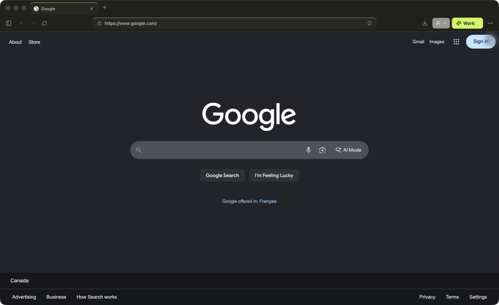
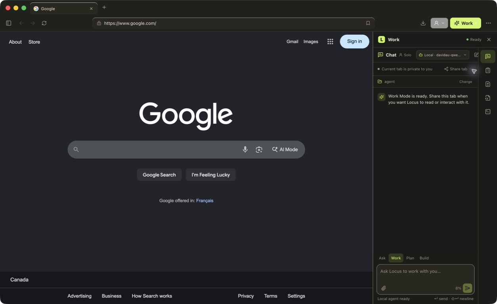
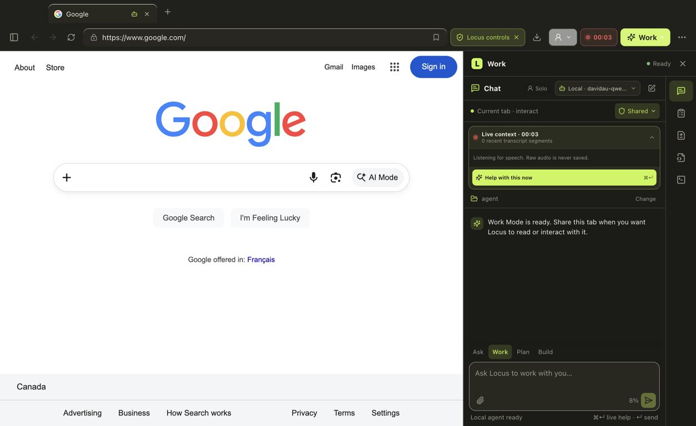

# Locus Browser


A browser-first sibling to Locus: a secure Chromium browser with an explicit,
resizable Solo Work dock. The page remains the primary canvas and the local
agent can control only tabs the user shares or tabs the current conversation
creates.

### Browser first



### Solo Work when you need it



### Live help with what you see and hear



This checkout is the source-complete Apple Silicon macOS canary candidate. See
[`docs/implementation-status.md`](docs/implementation-status.md) for its exact
scope and the external signing, gallery, and review gates required before
inviting canary users. It does not claim stable-release parity yet.

## Repository layout

- `apps/desktop` — Electron main process, secure preload, React browser chrome,
  work dock, tab broker, and agent runtime connection.
- `packages/extensions` — curated Manifest V3 capability and signed `.locusx` package checks.
- `packages/sync-crypto` — client-side encrypted sync records and device keys.
- `services/gallery` — fail-closed curated extension catalog and immutable package delivery.
- `services/sync` — transport-neutral opaque sync API and PostgreSQL repository.
- `services/sync-worker` — production Cloudflare Worker with Hyperdrive, R2,
  request limits, readiness checks, and orphan cleanup.
- `supabase` — private sync schema, least-privilege runtime role, and permission tests.

Shared agent and browser-wire contracts come from the sibling
[`locus-platform`](https://github.com/nahid-sparktales/locus-platform) repository.
This candidate is verified against the immutable `v0.1.0-canary.4` platform tag.

## Run the desktop app

```bash
pnpm install
pnpm dev:desktop
```

The browser has its own data directory and does not read or migrate data from
Locus. Set `LOCUS_PLATFORM_ROOT` to override the sibling platform checkout used
for the development agent runtime. `LOCUS_BROWSER_USER_DATA` can point smoke
tests at an isolated support directory without touching a normal profile.

The browser foundation includes an explicit first-run search choice,
persistent profiles and tab groups, explicit site-permission prompts,
selectable theme/download/sleep settings, profile-scoped OS-encrypted password
save/autofill, media controls, and protected wake-on-select tab sleeping. Its
light and dark surfaces use the same semantic palette as native Locus.

Work Mode is intentionally focused on the solo-agent workflow. Its compact
right-side rail keeps only Chat, Plan, Changes, Files, and Terminal. You can
start a new local conversation or reopen a previous one from the browser
sidebar, choose its trusted workspace from native browser chrome, and attach
bounded PNG, JPEG, GIF, or WebP images without exposing file paths to the
renderer. Conversation transcripts stay on the device. Closing the dock does
not stop an active run, while Stop returns the UI to idle immediately and
interrupts the agent at its next safe boundary.

Plan, Changes, Files, and Terminal are now live solo-agent surfaces rather
than placeholders. Plans show task progress and an explicit Build decision;
Changes uses the shared runtime's structured Git status and per-file diffs;
Files previews bounded UTF-8 workspace files while excluding secrets, binary
artifacts, dependency/cache trees, and symlink escapes; Terminal shows the
agent's permission-aware tool activity and bounded output. If the local agent
stops, the browser retries three times and restores the saved conversation and
workspace. A manual Reconnect action remains available after retries are
exhausted.

The toolbar's **Record** control starts one clearly indicated live-context
session for the current Work conversation. It follows only tabs explicitly
shared with that conversation (or tabs that conversation created), pauses on
private, internal, local-file, protected, or revoked tabs, and captures only
the webpage canvas. Tab audio and microphone are independently visible and
changeable; optional redacted video export is off by default. Closing Work Mode
does not end an active recording.

Speech defaults to the pinned, checksummed on-device Whisper runtime. Settings
can instead reuse the OS-encrypted OpenAI API credential with
`gpt-4o-mini-transcribe`, or use a validated OpenAI-compatible HTTPS or loopback
endpoint. Audio is chunked by source and is never retained. Cloud transcription
failures create a visible gap and offer the on-device fallback.

Recording supplies bounded recent/relevant transcript, safe page text, tab
metadata, and—after the existing hosted-screenshot consent—redacted keyframes
only when the user sends a message. **⌘Enter** asks for help with what is visible
and audible now, or steers the active run. Captured page and speech content is
always treated as untrusted evidence, never as agent instructions. Transcripts
are encrypted per record with a random key protected by macOS secure storage,
stay local until explicitly deleted, and never enter browser sync. Raw audio is
never written to the transcript store; video is kept only when explicitly
enabled and exported by the user.

The model picker matches native Locus with ChatGPT Plan, ChatGPT API, Kimi,
Claude API, vLLM/OpenAI-compatible endpoints, and models installed through
Ollama. The active model is saved per browser profile. Provider keys are
entered in a native hidden field, encrypted with macOS secure storage, and
never placed in page content, Work Mode state, or renderer IPC. ChatGPT Plan
uses the pinned [OpenAI Codex App Server](https://learn.chatgpt.com/docs/app-server)
bundled inside the signed application.
Its archive, executable, architecture, version, upstream signing identity, and
license are verified while packaging; the runtime is signed again as part of
the Locus Browser app. Development checkouts still fail closed unless a helper
is deliberately configured or the packaged runtime has been prepared.

The app identity is the Locus lime tile with a single black **L**. The source
assets live at `apps/desktop/assets/icon.png` and `icon.icns`; macOS installs
the same icon for the application window and Dock while running locally.

Extensions are profile scoped and disabled in Private Windows. Settings accepts
signed `.locusx` packages through a native file and permission review, verifies
both the publisher signature and a built-in Locus gallery countersignature,
then extracts only inventoried files into profile-owned storage. Updates must
keep the same publisher; the previous verified version remains available for a
one-click rollback. Package versions, trust identities, enable state, restart
loading, and removal are persisted without exposing managed paths to the UI.

An explicitly warned Developer Mode remains available for local unpacked MV3
extensions. Both install paths show API and site access before first load or
permission expansion. The main process rejects symlinks, unsafe resource paths,
unsupported manifest capabilities, remote executable code, archive bombs, and
review-to-install changes. Only curated gallery metadata participates in sync;
developer extensions, local paths, and extension storage never do. The current
engine-backed permission allowlist is deliberately narrow: `activeTab`,
`scripting`, `storage`, `tabs`, and `webRequest`; broader gallery APIs remain
future compatibility work. The versioned package contract is documented in
[`docs/locusx-format.md`](docs/locusx-format.md).

The curated gallery is a main-process-only catalog and download path. Catalogs
and revocations are signed offline, staged rollouts are deterministic, revoked
installs are unloaded, and the last verified security notice remains enforceable
offline. The desktop keeps downloads on the configured origin, streams them into
private temporary storage, checks size and SHA-256, and then independently runs
the `.locusx` verification and native permission review. In development, run the
read-only service and point the app at it with `LOCUS_EXTENSION_GALLERY_URL`:

```bash
docker compose -f compose.gallery.yaml up --build
LOCUS_EXTENSION_GALLERY_URL=http://127.0.0.1:8790 \
LOCUS_GALLERY_TRUST_DEVELOPMENT_DOCUMENTS=1 pnpm dev:desktop
```

Place canary-signed packages in the ignored `gallery-packages` directory before
starting the service. Production starts only from signed metadata that exactly
matches that immutable package directory. See
[`docs/extension-gallery.md`](docs/extension-gallery.md) for publication and
revocation procedures.

Optional Locus encrypted sync now provides passkey accounts and client-side
encrypted bookmarks, history, tab groups, ordinary web tabs, selected settings,
and curated extension metadata. Sync keys stay protected by the operating
system. Connected devices can approve a new Mac without exposing the account
key to the service, revoke other devices, and rotate the recovery key across
the entire encrypted replica in one versioned operation. A newly generated or
rotated recovery key is shown once in a native dialog.
Production uses a dedicated Supabase Postgres project for private opaque
metadata and a Cloudflare Worker for the public API. Hyperdrive connects
directly to the least-privilege database role, while private R2 stores larger
encrypted envelopes. Small ciphertext remains in PostgreSQL. Staged writes,
post-commit cleanup, and a daily orphan reconciler preserve conflict, rotation,
and account-deletion behavior across both stores. Supabase Auth, Storage,
Realtime, and the Data API are not part of the sync trust boundary.
The canary service is live at [`https://sync.locushost.co`](https://sync.locushost.co/ready);
the custom domain is the only public Worker route, and `/ready` checks both the
database and private object store before reporting healthy.
Passwords, cookies, downloads, workspaces, conversations, memory, provider
credentials, and run records remain local. For local development, start the
sync stack and point the desktop UI at it with `VITE_LOCUS_SYNC_URL`:

```bash
docker compose -f compose.sync.yaml up --build
VITE_LOCUS_SYNC_URL=http://localhost:8787 pnpm dev:desktop
```

The production setup and rollback checklist is in
[`docs/sync-deployment.md`](docs/sync-deployment.md).

For renderer-only UI work, `pnpm --filter @locus/browser-desktop exec vite`
opens a safe local preview with representative browser state. Production file
builds never install that preview bridge; they require the sandboxed Electron
preload and main-process schema validation.

The harmless unpacked fixture at `fixtures/extensions/reading-notes` can be
used to verify Developer Mode and content-script loading against
`https://example.com` in an isolated profile. Signed-package tests create
ephemeral publisher and gallery keys so no production signing secret is kept
in this repository.

## Verify

```bash
pnpm canary:check
pnpm typecheck
pnpm test
pnpm build
pnpm --filter @locus/browser-desktop compat:extensions
pnpm --filter @locus/browser-desktop acceptance:ui
pnpm audit --prod --audit-level high
pnpm release:sbom
```

## Canary release

The protected `canary-vX.Y.Z-canary.N` tag workflow builds the embedded Python
runtime, seals the controlled gallery and sync HTTPS origins into the signed
application, produces Apple Silicon DMG/ZIP artifacts, notarizes and staples
them, checks Gatekeeper, generates a CycloneDX SBOM, signs a hash manifest, and
publishes an immutable GitHub prerelease. The operator checklist and rollback
procedure are in [`docs/canary-runbook.md`](docs/canary-runbook.md).

The first release target is signed/notarized Apple Silicon macOS 14+. The
application is not a Mac App Store target. Team orchestration and unproven
Chrome-style extension APIs remain post-canary so this release can stay focused
on normal browsing and a reliable solo agent.
