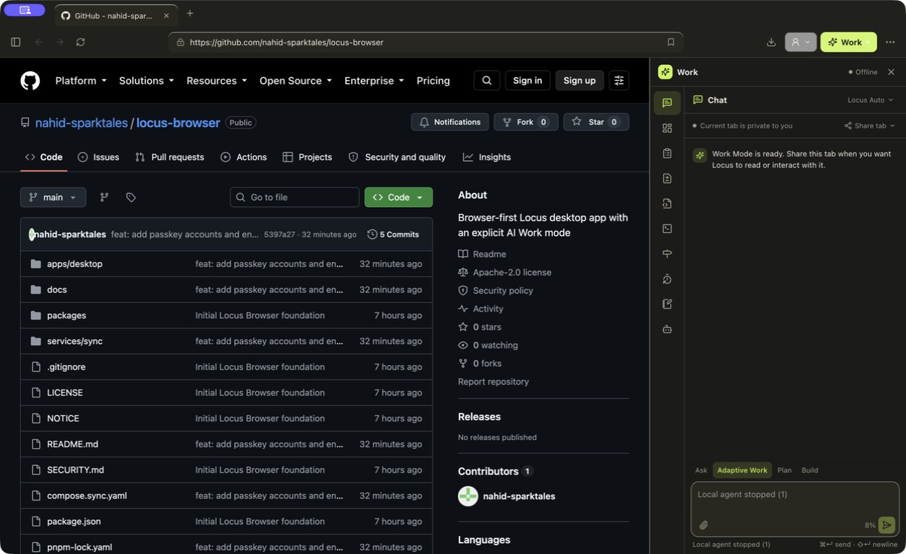

# Locus Browser


A browser-first sibling to Locus: a secure Chromium browser with an explicit,
resizable Solo Work dock. The page remains the primary canvas and the local
agent can control only tabs the user shares or tabs the current conversation
creates.



This checkout is the executable engine proof and product foundation. See
[`docs/implementation-status.md`](docs/implementation-status.md) for the exact
canary work that remains; it does not claim stable-release parity yet.

## Repository layout

- `apps/desktop` — Electron main process, secure preload, React browser chrome,
  work dock, tab broker, and agent runtime connection.
- `packages/extensions` — curated Manifest V3 capability and signed `.locusx` package checks.
- `packages/sync-crypto` — client-side encrypted sync records and device keys.
- `services/sync` — opaque-record PostgreSQL sync service.

Shared agent and browser-wire contracts come from the sibling
[`locus-platform`](https://github.com/nahid-sparktales/locus-platform) repository.

## Run the desktop app

```bash
pnpm install
pnpm dev:desktop
```

The browser has its own data directory and does not read or migrate data from
Locus. Set `LOCUS_PLATFORM_ROOT` to override the sibling platform checkout used
for the development agent runtime. `LOCUS_BROWSER_USER_DATA` can point smoke
tests at an isolated support directory without touching a normal profile.

The browser foundation includes an explicit first-run search choice,
persistent profiles and tab groups, explicit site-permission prompts,
selectable theme/download/sleep settings, profile-scoped OS-encrypted password
save/autofill, media controls, and protected wake-on-select tab sleeping. Its
light and dark surfaces use the same semantic palette as native Locus.

Work Mode is intentionally focused on the solo-agent workflow. Its compact
right-side rail keeps only Chat, Plan, Changes, Files, and Terminal. You can
start a new local conversation or reopen a previous one from the browser
sidebar, choose its trusted workspace from native browser chrome, and attach
bounded PNG, JPEG, GIF, or WebP images without exposing file paths to the
renderer. Conversation transcripts stay on the device. Closing the dock does
not stop an active run, while Stop returns the UI to idle immediately and
interrupts the agent at its next safe boundary.

Plan, Changes, Files, and Terminal are now live solo-agent surfaces rather
than placeholders. Plans show task progress and an explicit Build decision;
Changes uses the shared runtime's structured Git status and per-file diffs;
Files previews bounded UTF-8 workspace files while excluding secrets, binary
artifacts, dependency/cache trees, and symlink escapes; Terminal shows the
agent's permission-aware tool activity and bounded output. If the local agent
stops, the browser retries three times and restores the saved conversation and
workspace. A manual Reconnect action remains available after retries are
exhausted.

The model picker matches native Locus with ChatGPT Plan, ChatGPT API, Kimi,
Claude API, vLLM/OpenAI-compatible endpoints, and models installed through
Ollama. The active model is saved per browser profile. Provider keys are
entered in a native hidden field, encrypted with macOS secure storage, and
never placed in page content, Work Mode state, or renderer IPC. ChatGPT Plan
uses Locus's managed sign-in flow and reports unavailable when its pinned
runtime component is not installed in a development checkout.

The app identity is the Locus lime tile with a single black **L**. The source
assets live at `apps/desktop/assets/icon.png` and `icon.icns`; macOS installs
the same icon for the application window and Dock while running locally.

Extensions are profile scoped and disabled in Private Windows. Settings now
offers an explicitly warned Developer Mode for local unpacked MV3 extensions,
shows API and site access before first load or permission expansion, and lets
the user enable, disable, or remove each install. The main process scans a
bounded folder, rejects symlinks, unsafe resource paths, unsupported manifest
capabilities, and remote executable code, then loads the extension into the
profile session before restored pages open. Unpacked developer extensions and
their local paths are never synced. The current engine-backed permission
allowlist is deliberately narrow: `activeTab`, `scripting`, `storage`, `tabs`,
and `webRequest`; broader gallery APIs remain future compatibility work.

Optional Locus encrypted sync now provides passkey accounts and client-side
encrypted bookmarks, history, tab groups, ordinary web tabs, selected settings,
and curated extension metadata. Sync keys stay protected by the operating
system. Connected devices can approve a new Mac without exposing the account
key to the service, revoke other devices, and rotate the recovery key across
the entire encrypted replica in one versioned operation. A newly generated or
rotated recovery key is shown once in a native dialog.
Passwords, cookies, downloads, workspaces, conversations, memory, provider
credentials, and run records remain local. For local development, start the
sync stack and point the desktop UI at it with `VITE_LOCUS_SYNC_URL`:

```bash
docker compose -f compose.sync.yaml up --build
VITE_LOCUS_SYNC_URL=http://localhost:8787 pnpm dev:desktop
```

For renderer-only UI work, `pnpm --filter @locus/browser-desktop exec vite`
opens a safe local preview with representative browser state. Production file
builds never install that preview bridge; they require the sandboxed Electron
preload and main-process schema validation.

The harmless unpacked fixture at `fixtures/extensions/reading-notes` can be
used to verify Developer Mode and content-script loading against
`https://example.com` in an isolated profile.

## Verify

```bash
pnpm typecheck
pnpm test
pnpm build
```

The first release target is signed/notarized Apple Silicon macOS 14+. The
application is not a Mac App Store target.
